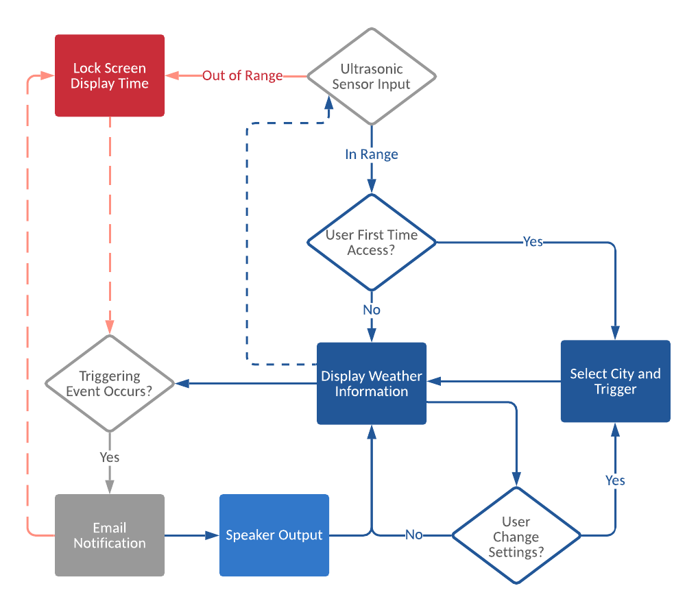

# Project Name here
###### 4180 Final Project - Luca DeCicco, Jinghong Peng, Bingyue Zhao

## Overview
Lorem ipsum dolor sit amet, sit unum reque an, mea nonumy deserunt perpetua an, elitr everti oblique in vim. Sed ei harum eloquentiam. Nostro persecuti interpretaris vix te, eum habeo partem eu. Case nostrud qualisque ad eos, vel brute possim evertitur ut.Lorem ipsum dolor sit amet, sit unum reque an, mea nonumy deserunt perpetua an, elitr everti oblique in vim. Sed ei harum eloquentiam. Nostro persecuti interpretaris vix te, eum habeo partem eu. Case nostrud qualisque ad eos, vel brute possim evertitur ut.
#### Demo Video

## Hardware
list hardware used in the project here

Detailed info about each hardware

Pinout and connection

### Ultrasonic Sensor
### Speaker

## Software Development
written in python
### AWS
description of the setup and functionality of AWS. Reference to the Corresponding py file. brief descriptions for SDK/packages/modules used. Feel free to break into smaller sections
### GUI Display
description of the setup and functionality of AWS. Reference to the Corresponding py file. brief descriptions for SDK/packages/modules used. Feel free to break into smaller sections

## Setup and Installation
Initial Pi setup

terminal command for installing modules/packages

## TroubleShooting
possible troubles when setting up the project and how to fix them
## Reflection
what to improve. Thought on future work
## Resources
reference on external resources
